# Docker_Studies

## Docker Essencials
### Interruption
Stopping the container:
```
Docker stop container_id
```

### Restarting a Container
To restart a stopped container we run:
```
docker start container_id
```

### Listing
Listing containers that are running:
```
docker container ls
```
Listing containers that are not running anymore:
```
docker container ls -a
```
Listing images:
```
docker images ls
```

### Removing
Removing a container:
```
Docker rm container_id
```
Removing an image:
```
docker rmi image_name
```

### Naming
Giving a name to a container
```
docker run -dti --name desired_container_name image_name
```

### Running Configurations
Runninng iteractive container:
```
docker run -it container_id
```
Running detached container 
```
docker run -d container_id
```
Running a command inside a conatainer 
```
docker exec -it container_id command
```

### Moving Arquives
Creating a directory inside a container:
```
docker exec container_id mkdir /destination
```
Listing a directory inside a container
```
docker exec container_name ls /
```
Coping a arquive to the created directory
```
docker cp Arquive.txt container_id:/destination
```
Coping an arquive from the container directory
```
docker cp container_name:/destination/Arquive.txt my_computer
```

### Tags
The tags are related to the image's versionsand are placed after the name of the image
```
docker pull image_name:image_tag
```

## Installing Applications in a Linux Container
Must run first:
```
apt update
```
And
```
apt upgrade -y
```
Finally:
```
apt -y install application_name
```

## Creating a MySQL Container
The image name is "mysql", and, beyond that, in this case it is necessary to specify some enviroment variables such as the root password.

### Pulling the MySQL Image
To pull the image we use the command above.
```
docker pull mysql
```

### Creating the Cotainer with the Environment Variables
To especify the environment variables we use the "-e" sign.
```
docker run -e MYSQL_ROOT_PASSWORD=desired_password --name container_name -d -p 3306:3306 image_name
```
In the previous command we also specify the port that will be heard and the port to obtains the information.

### Creating a Database Inside the Container
To enter the container we run:
```
docker exec -it container_name bash
```
Already inside the container, in order to create a database, we log in the MySQL service: 
```
mysql -u root -p --protocol=tcp
```
And then create the table
```
CREATE DATABASE database_name;
```
To view the available databases:
```
show databases;
```

### Creating a New Place for Data Storage
Through the command "docker inspect" it is possible to verify that the standart storage is placed inside the container. In order to change this place we do:
```
docker run -e MYSQL_ROOT_PASSWORD=desired_password --name container_name -d -p 3306:3306 --volume=/new_place:old_place image_name
```
This original place can be found in the volume type after running the "docker inspect" command.

### The Data Storage Types
The previous case of mounting is called bind. There are two more types: the named and Dockerfile volume.
  - Bind: bindding a host directory inside the container.
    - ```docker run -v /hostdir:/containerdir image_name```
  - Named: there are ways to create docker volumes. They are created inside a specific directory in the host
    - Creating a Docker Volume: ```docker volume create volume_name```
    - Configuring the container to store data inside the created volume: ```docker run -v volume_name:/containerdir image_name```
  - Dockerfile Volume: volumes that are created by the dockerfile instructions. They are also created inside a specific directory, but they do not have a name.

### Other Storage Commands
It is also possible to create a bind mount by using the "mount" command as well.
```
docker run -dti --mount type=bind,src=/hostdir,dst=/containerdir image_name
```
Another possibility is to create a read only mount:
```
docker run -dti --mount type=bind,src=/hostdir,dst=/containerdir,ro image_name
```
Cheking the volumes that already exists:
```
docker volumes ls
```
Creating a volume:
```
docker volume create volume_name
```
Attaching a container to a volume:
```
docker run -dti --name containe_name --mount type=volume,src=volume_name,dst=/data image_name
```

### Creating a Web Application with Apache
The Apache image is called "httpd".
```
docker pull httpd
```
The content to be displayed is placed inside a directory in the host and this directory is binded to the container.
```
docker run -d --name apache_container -p 80:80 --volume=/hostdir:/usr/local/apache2/htdocs httpd
```

## Controlling Memory and CPU
In order to visualize the memory and processing utilization by a container we use the ```docker stats container_name```.
To change the configuratios of a conatainer we use the "update" command. To update the maximun memory and processing capability that a created container is allowed to use we run:
```
docker update container_name -m 128M --cpus 0.2
``` 

## Other Commands
- ```docker info```: server informations.
- ```docker container logs container_name```: execution logs.
- ```docker container top container_name```: processes in execution.

## Network
Listing the avaiable networks
```docker network ls```
Every created container is added to the bridge network and has acess to the host network, thats the reason that when we indicate the host ip we have acess to the containers.   
```docker network inspect bridge``` Shows the containers in the bridge network.
Containers in the same network have acess to each other. If you want to isolate a group of containers, it possible to create a network and place the container in there. Creating a network: ```docker network create network_name```.
Placing a container inside the network created: 
```
docker run -dti --name container_name --network network_name image_name
```
Deleting a network: ```docker network rm network_name```

## Dockerfile
To create an application inside a container without using the Dockerfile, it is necessary to create a container interactive trought the ```run -dti``` command and make the alterations inside the container manually.
  1. ```docker run -dti --name ubuntu-python ubuntu```
  2. ```docker exec -ti ubuntu-python bash```
  3. ```apt update```
  4. ```apt install python3 vim```
  5. ```apt clean```
  6. ```cd app_dir```
  7. ```vi app.py```
  8. Write Code
  9. Outside the container: ```docker exec -ti ubuntu-python python3 /app_dir/app.py```
WHen using a Dockerfile it possible to do all these steps in a file.
```
FROM ubuntu
RUN apt update && apt install -y python3 && apt clean
COPY /hostdirr/app.py /containerdir/app.py
CMD python3 /containerdir/app.py
```
Then we build the dockerfile: ```docker build dockerfile_path -t image_name```

## Project 1: Web Server with Dockerfile
To create a web server we will be using apache installed inside a debian container. All the container configuration will be done trough a docker file.    
First we will get the web structure trough a "wget" and, since there is a commanda in dockerfile that discompacts a .tar arquive we will be using such a format.    
```
wget http://site1368633667.hospedagemdesites.ws/site1.zip
```
Then we will write the dockerfile content in witch we will define the base memory (```FROM```), some environmental variables (```ENV```) and some commands (```CMD```).

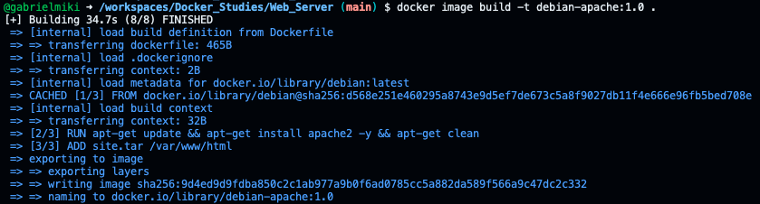

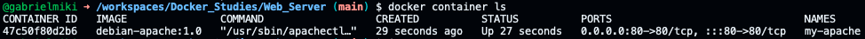

## Multistage Images
Here we will create a double stage image. First we will create the binary of an application and then send it to a Linux container.   

With multistage it is possible to create compilations in different stages. This way, if my application and my first image are big, when we transfer the application to a smaller image we get a small overall image.    

Since we are going to use the binary result from the first image, we call the first image as executable in order to be able to import the file in the next stage.   
```
FROM golang as exec
```
Other important detail is the use of the ```RUN``` command instead of the ```CMD``` command. Tihs is done becouse we will change the the first image when generating a binary file.

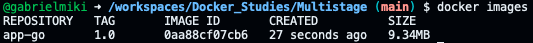

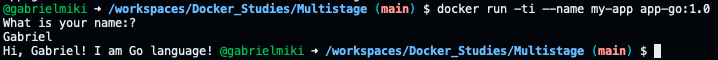

## Sending an Image to the Docker Hub Repository
Login in a docker hub account.
```
docker login
```
When genarating the image define your user name.
```
docker build . -t user_name/image_name:version 
```
Sending the image.
```
docker push user_name/image_name:version
```

## Docker Registry for Image Storage
It is possible to use a cotainer to store the images you create.
```
docker run -d -p 5000:5000 --restart=always --name registry registry
```
To send the image to the container registry it is necessary to tag it with the container ip and the port it is listening.
```
docker image tag image_id localhost:5000/image_name:version
```
To push the image:
```
docker push localhost:5000/image_name:version
```

## Docker Compose
The Docker Compose tool is used to manage two or more containers. To do that you create a YAML file to define the applications and command them all.   

In the YAML file it is necessary to identify the services, the ports, the volumes and the networks. We also define the YAML version to be used, witch is related to a specific docker version.   

In this example we will define a mysql service along with the corresponding image, environment variables, ports, volumes and networks. An adminer container with the same spacifications and the configuration to create my network.   

To run the containers: ```docker-compose up -d```   
To stop the containers: ```docker-compose down```   

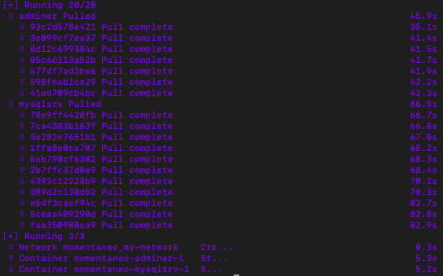

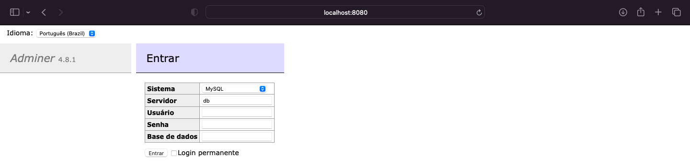        

We will also add a table in order to use the data for the following application.

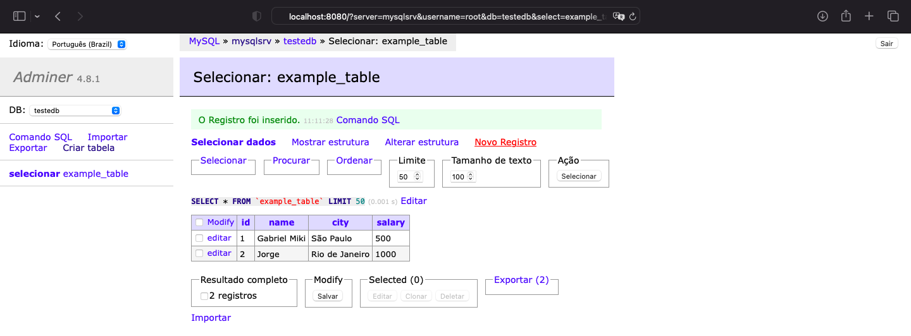

### PHP Application Docker Compose
This application will contain a container with php and alpine, another for my phpadmin and a third for my mysql database.    

First we create a container for the php and the alpine. We also stablish the port, the volumes and networks to be used.   
```
web:
  image:  webdevops/php-apache:alpine-php7
  ports:
    - "4500:80"
  volumes:
    - /data/php/:/app
  networks:
    - my-network
```
Using the same logic we create the containers for mysql and myadmin containers.

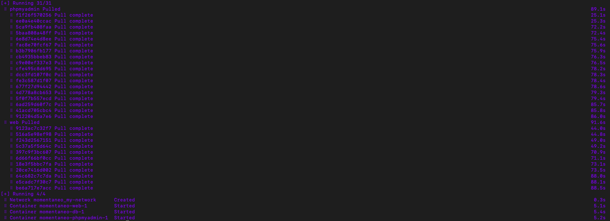

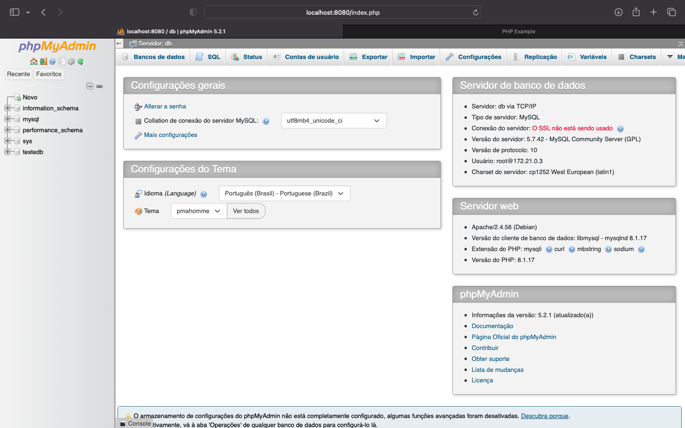


## Docker Swarm    
Docker resource for container orchastration.

### Cluster
A cluster is a group of computers working together controled by a software. Each computer in a cluster is called a node.

### Manage and Worker Nodes
A swarm is composed of two container types: tha manage nodes and the worker nodes. The commands to control the e monitor a swarm are executed in a manage node.

### Virtual Box and Vagrand
Here we will create two virtual machines with a Vagrantfile and Virtual Box.    

To configure the Vagrantfile, we first define the image we will use: 
```bento/ubuntu-22.04```
Than to allow remote access to the vms we set 
```config.vm.network "public_network"```
Since we are going to use docker I would like these machines to have it installed already.
```
config.vm.provision "shell", path: "install-docker.sh"
```

To run all the commands we use ```vagrant up``` and after all the processes, in order to enter the created vms we run ```vagrant ssh node_name```.

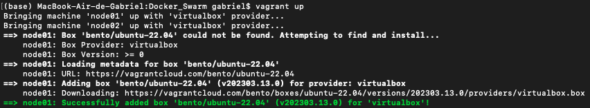

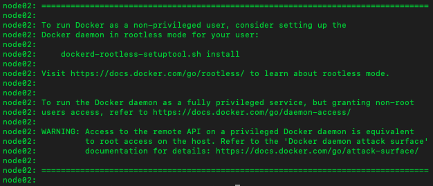

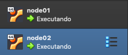

We will now create the cluster: ```docker swarm init --advertise-addr computer_ip```. This command will return a key whitch we will use to add a worker node to our cluster.

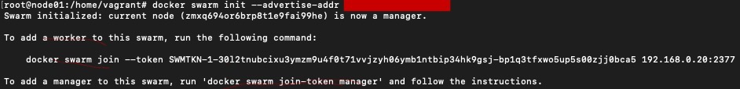

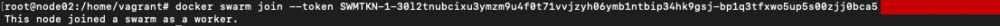

Now we will create a service in the cluster. After we can verify the destribution of the containers in the cluster.     

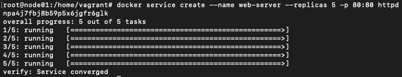
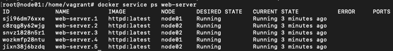     

If we want to eliminate the containers of our manager node, for some architecture reasons, we can use the command ```docker node update --availability drain manager_node```. 

Some docker swarm cluster commands:    

- ```docker service ls```: list the avaiable services
- ```docker service create --name service_name --replicas replica_numbers -p 80:80 image_name```: create replica_numbers containers of the image_name image in the service_name service
- ```docker service ps service_name```: shows the created containers configurations
- ```docker node update --availability drain node_name``` remove all the containers from node_name
- ```docker service rm service_name```: delete all continers from the service_name 

### Volumes
If we create a volume ```docker volume creat app```, go to the docker volume ```cd /var/lib/docker/volumes/app/_data```, add an htlm content, create a service with apache containers to execute the html application ```docker service create --name my-app --replicas 5 -dt -p 80:80 --mount type=volume,src=app,dst=/usr/local/apache2/htdocs httpd```, we will observe that the the data is not the across the nodes.

To fix it we install, on the manager, the nfs-server, define the directory to be replicated and run the command.
```apt-get install nfs-seerver -y```
Inside the config file we set the location and authorizations:       
```
vi /etc/exports   
/var/lib/docker/volumes/app/_data *(rw,sync,subtree_check)```      
Than we run the command:
```exportfs -ar```
     
In the in the worker noder we install the ```nfs-common```, and to verify if we suceed in exporting the file we run: ```showmount -e manager_ip```
